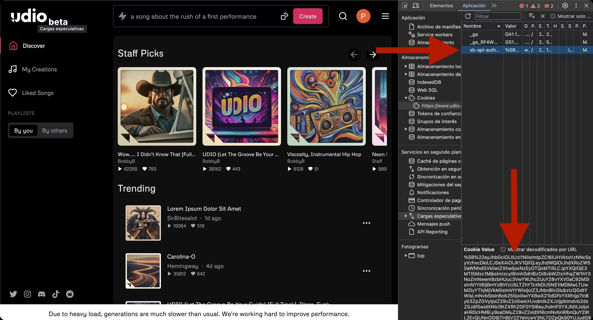

# Udio Wrapper


Written by @Flowese

<a href="https://colab.research.google.com/drive/11BqjonOql85BkB4tbxpI_lq2rfGkc60Y?usp=sharing" target="_blank"></a>

## Description

`udio_wrapper` is a Python package that allows you to generate music tracks from Udio's API using textual prompts. This package is designed to interact with Udio's API and is not officially endorsed by Udio.

## Advantages Over Other Models

Unlike other music generation models, Udio offers a unique feature of extending or conditioning new tracks based on existing ones, making it ideal for iterative and creative music production processes.

## Legal Disclaimer

This package is created for educational and research purposes. By using this package, you agree to do so at your own risk. This package is not affiliated, endorsed, or sponsored by Udio in any way.

## Requirements

- Python 3.x
- pip

## Installation

### From PyPI

To install the package from PyPI, run the following command:

```bash
pip install udio_wrapper
```

To upgrade the package from PyPI, run the following command:
```bash
pip install --upgrade --no-cache-dir udio_wrapper
```


### From GitHub Repository

To install the package directly from the GitHub repository, run:

```bash
pip install git+https://github.com/flowese/UdioWrapper.git
```

## Configuration

### Obtaining the Authorization Token

1. Sign up at [Udio](https://www.udio.com/).
2. Once registered, open your browser's inspector:
   - In Chrome: `Ctrl+Shift+I` or `F12` on Windows, `Cmd+Option+I` on Mac.
3. Go to the `Application` tab.
4. On the left panel, locate and click on `Cookies`, then select the Ideogram website.
5. Find the cookie named `sb-api-auth-token`.
6. Click on `sb-api-auth-token` and copy the value in the `Value` field.



### Usage

To use `udio_wrapper`, import the `UdioWrapper` class and provide the necessary parameters.

## Usage Examples

The following examples demonstrate various ways to use the `UdioWrapper` to generate music based on different scenarios:

```python
auth_token = "your-auth-token-here"  # Replace this with your actual authentication token
udio_wrapper = UdioWrapper(auth_token)
```

1. Creating a Short Song
You can specify the prompt, seed, custom lyrics.
```python

short_song_no_download = udio_wrapper.create_song(
    prompt="Relaxing jazz and soulful music",
    seed=-1,
    custom_lyrics="Short song lyrics here"
)
print("Short song generated without downloading:", short_song_no_download)
```
2. Extending a Song
Extend a previously created song by providing its path and ID for conditioning. This method also allows for lyric customization.
```python

extend_song_download = udio_wrapper.extend(
    prompt="A dynamic version of relaxing jazz and soulful music",
    seed=-1,
    audio_conditioning_path="url-generated-song",
    audio_conditioning_song_id="previous-song-id",
    custom_lyrics="Extended version lyrics"
)
print("Extended song generated and downloaded:", extend_song_download)
```

3. Adding an Outro
Generate an outro for your music sequence using the last song as a base. This includes custom lyrics.
```python

outro_song_download = udio_wrapper.add_outro(
    prompt="A smooth ending to our jazz session",
    seed=-1,
    audio_conditioning_path="url-generated-song",
    audio_conditioning_song_id="last-extended-song-id",
    custom_lyrics="Outro lyrics here"
)
print("Outro song generated and downloaded:", outro_song_download)
```

4. Creating a Complete Song Sequence
Generate a full sequence of songs, including multiple extensions and an outro. This process involves defining prompts and lyrics for each part of the sequence.
```python
complete_song_sequence = udio_wrapper.create_complete_song(
    short_prompt="On a full moon night",
    extend_prompts=["the soft sound of the saxophone fills the air", "creating an atmosphere of mystery and romance"],
    outro_prompt="Thus ends this melody, leaving an echo of emotions in the heart",
    num_extensions=2,
    custom_lyrics_short="Short song lyrics here",
    custom_lyrics_extend=["Lyrics for first extension", "Lyrics for second extension"],
    custom_lyrics_outro="Outro lyrics here"
)
print("Complete song sequence generated and downloaded:", complete_song_sequence)
```

#### Parameters

- **`auth_token`** *(Required)*: The authorization token you obtained from Udio, which is necessary for authenticating and making API requests.


Each method in the `UdioWrapper` class can take several parameters to control song generation and processing. Below is a breakdown of the parameters and their usage:

- **prompt** *(str)*: A text prompt describing the theme or emotion of the song. This is the creative input from which the song generation is based.

- **seed** *(int, optional)*: A seed number to ensure the reproducibility of the song generation. Using the same seed with the same parameters will generate the same audio output. Default is `-1`, which results in random generation each time.

- **custom_lyrics** *(str, optional)*: Lyrics written by the user to be included in the song. If no lyrics are provided, the generation relies solely on the musical style implied by the prompt.

- **audio_conditioning_path** *(str, optional)*: The file path to an audio file that will serve as a base or influence for the song being generated. This is used primarily for extending songs or generating outros based on a previous song.

- **audio_conditioning_song_id** *(str, optional)*: The identifier of a previously generated song that will be used to influence the current song generation. This is necessary when creating extended songs or outros that are meant to follow a specific musical piece.

- **num_extensions** *(int, optional)*: Specifies the number of extended songs to generate in a sequence. This parameter is only used in the method that generates a complete song sequence. Default is `1`.

- **extend_prompts** *(list of str, optional)*: A list of prompts for generating each extension in a sequence. Each prompt should ideally reflect a progression or variation in style or theme from the previous song.

- **outro_prompt** *(str, optional)*: A prompt specifically for generating an outro. This should convey a sense of conclusion or finale relative to the musical sequence.


These parameters allow full customization of the music generation process, from the initial creation through extensions to the final outro, giving users the ability to tailor both the music and lyrics to fit their specific needs or artistic vision.


## License

This project is licensed under the MIT License.

## Contributing

If you'd like to contribute to this project, feel free to fork the repository and send a pull request, or open an issue to discuss what you'd like to change. All contributions are welcome!

## TODO

### Pending Tasks and Features

- Improve error handling and response validation.
- Implement a user-friendly web interface for easier interaction with the API.

-----
